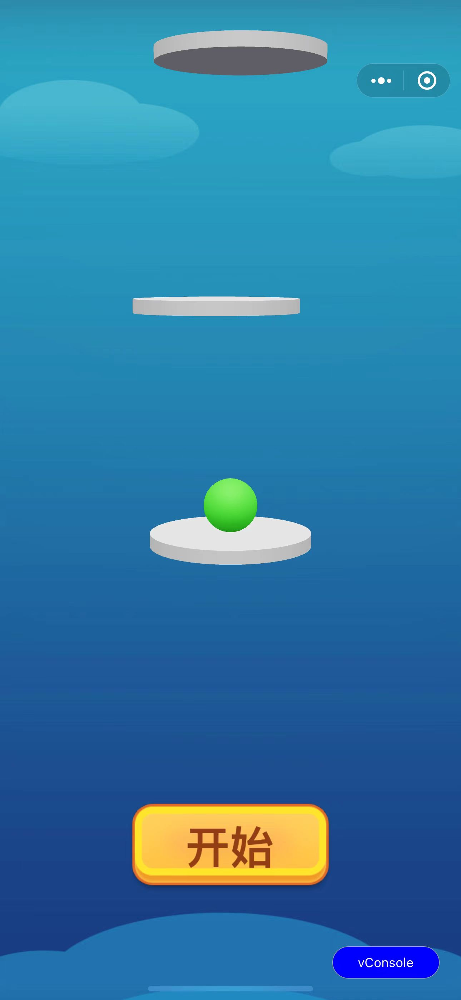
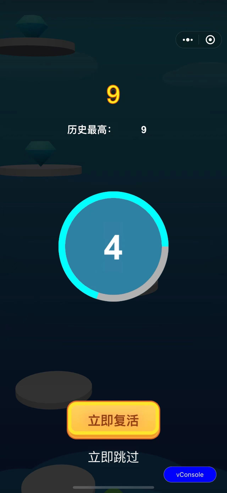

# 小游戏试玩
小游戏试玩是一种独立于小游戏之外的更轻量的运行时，其应用场景主要是在正式进入小游戏之前拉起一个轻量的运行时，能够让玩家先简单体验游戏的部分玩法，典型的应用场景是在小游戏激励视频场景，通过真实的游戏试玩来替代用户观看视频的体验。本仓库旨在维护小游戏试玩的一些示例和针对小游戏试玩提供的通用适配层。

## 示例

demos 目录主要承载一些第三方引擎的示例。
因为小游戏试玩依赖于独立分包能力，所以一个包含小游戏试玩包的游戏实际上至少包含了两个完整的游戏，为了方便组织 demo 目录，minigame-demo 目录作为小游戏主工程，其他 demo 会构建到 `demos/minigame-demo/playableDemo` 作为小游戏试玩工程，目录结构如下：
```
demos
 |--cocoscreator3-ball
 |--minigame-demo // 小游戏主工程，微信开发者工具默认创建的打飞机小游戏示例
    |--playableDemo // 其他 demo 构建到该目录下，可以灵活切换不用 demo 的小游戏试玩分包
      |--game.js // 小游戏试玩分包入口文件
      |--playable-adapter.js // 小游戏试玩通用适配器
      |--...  // demo 构建出来的其他产物

```

### 弹弹乐3D游戏
弹弹乐 3D 游戏（cocoscreator3-ball目录）是 Cocos Creator 的官方 demo，原始工程可查看[链接](https://github.com/cocos/cocos-example-ball)，此处仅用作示例，请勿用于商业用途。

最终试玩运行效果真机截图如下：

 

原始工程从小游戏构建为试玩只需要简单两步：
1. 以Cocos Creator项目为例，新建小游戏构建模板，在构建模板引入适配器，小游戏构建模板目录如下`build-templates`，其中 **playable-adapter.js** 文件来自 **playable-adapter/dist/playable-adapter.js**，详情可见下面小游戏试玩适配器(playable-adapter)介绍。
```
cocoscreator3-ball
 |--assets
 |--build
 |--build-templates
    |--wechatgame
      |--game.ejs
      |--game.json
      |--playable-adapter.js
      |--project.config.json

```

2. game.ejs 引入和初始化适配代码：
``` js
// 引用适配器
const PlayableAdapter = require('./playable-adapter.js').PlayableAdapter;

// 小游戏试玩支持多个独立分包，因此初始化需要传入独立分包的路径
new PlayableAdapter({
  userPathPrefix: 'playableDemo/',
});
```

如果不使用构建模板，只需要在构建后的 game.js 引入和初始化适配器。

## 小游戏试玩适配器(playable-adapter)
小游戏试玩环境并不是标准的小游戏环境，第三方游戏引擎构建为小游戏之后大概率会遇到各种报错，这些报错主要分两类：
1. 游戏引擎认为当前处于小游戏环境下，访问了一些小游戏特有的 API；
2. 小游戏试玩使用本地文件如音频和配置文件必须加上独立分包的名字作为前缀如`playableDemo/`;

小游戏试玩适配器的目的就是为了简化开发者对小游戏试玩环境的适配工作，通过引入 playable-adapter，能够避免上述两个问题。

### 自定义适配器
目前适配器能够覆盖 Cocos Creator 引擎 >= 2.4.11 版本和 >= 3.8.0 版本，如果使用其他版本 Cocos 或者其他引擎，可自定增加适配规则，执行构建。

1. 安装依赖
``` shell
cd playable-adapter && npm install
```

2. 构建
``` shell
npm run dev
```

构建后的文件为**playable-adapter/dist/playable-adapter.js**。